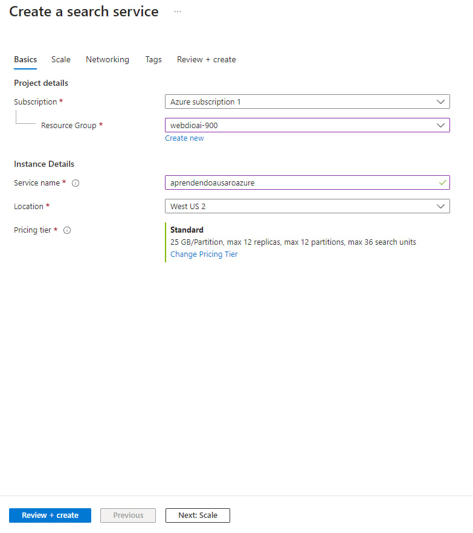

# Web Dio Azure AI Search

Azure AI Search é uma plataforma de recuperação de informações alimentada por IA que ajuda os desenvolvedores a construir experiências de pesquisa ricas e aplicativos de IA gerativos que combinam grandes modelos de linguagem com dados corporativos. Nesse projeto, uma coleção de prints mostrando o, passo-a-passo, o uso do AI Search, Azure AI services e o Storage Accounts.

## 1 - Criar um AI Search Service

## 2 - Preencher o formulário de criação do AI Search Service, definindo um nome único, o nível de preço e a região

## 3 - Visão Geral do AI Search Service depois de criado

## 4 - Criar um Azure AI Service e preencher o formulário, definindo o grupo de recurso associado, nível de preço, região e marcar a caixa de seleção

## 5 - Na categoria Storage, clicar em 'Criar' Storage Account

## 6 - Preencher o formulário de criação do Storage Account, definindo o grupo de recurso associado, nome único, região, nível de perfomance e o tipo de redundância

## 7 - Alterar a opção 'Nível de acesso anônimo' dentro do Container para permitir acesso tanto externo tanto ao Container quanto dos blobs

## 8 - Em 'Configuration', selecionar a opção 'Allow Blob anonymous access'

## 9 - Fazer o upload dos documentos que você irá usar para pesquisa e indexação

## 10 - Importa os dados do Storage Account para o AI Search Service

## 11 - Depois de tudo pronto, você pode fazer a pesquisa por qualquer palavra chave dentro dos seus documentos, no meu caso infelizmente não funcionou, embora eu tenha tentado e repetido várias vezes para solucionar o problema, eu não consigo importar os documentos do storage account, mas em geral deve funcionar para você, quando eu consegui irei atualizar esse readme
